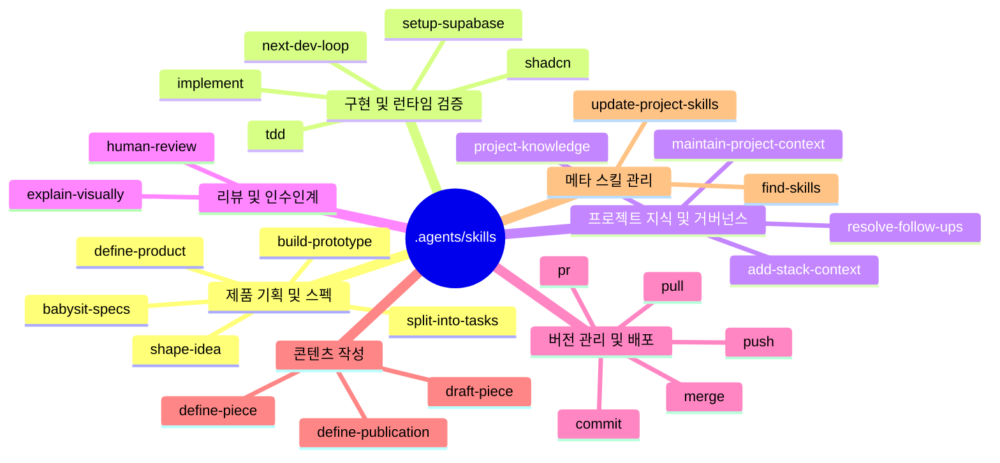
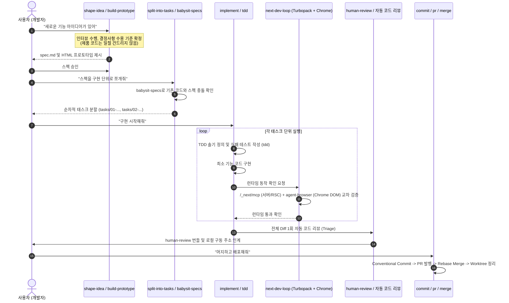

# 3x3_cube `.agents/skills` 전체 구조 및 동작 방식 분석 보고서

> **저장소**: [debtor1/3x3_cube](https://github.com/debtor1/3x3_cube.git)  
> **분석 대상**: `.agents/skills` (총 26개 에이전트 스킬)  
> **관련 설정**: `skills-lock.json`, `AGENTS.md`, `.claude/skills`

---

## 1. 개요 및 인프라 아키텍처

`3x3_cube` 저장소의 `.agents/skills`는 LLM 기반 자율 코딩 에이전트(OpenAI Codex, Claude Code 등)가 소프트웨어 제품의 기획부터 스펙 작성, TDD 기반 구현, 런타임 브라우저 검증, 코드 리뷰, Git PR/머지, 후속 과제 관리까지 전 과정을 엄격한 규율하에 수행할 수 있도록 구축된 **엔드투엔드 SDLC(소프트웨어 개발 수명주기) 에이전트 스킬 시스템**입니다.

### 1.1 스킬 관리 체계 및 출처 (`skills-lock.json`)
저장소 루트의 `skills-lock.json`에 기록된 정보에 따르면, 설치된 26개의 스킬들은 주로 다음과 같은 업스트림 소스로부터 유입되어 관리됩니다:

- **`toy-crane/skills`**: 전체 워크플로우를 주도하는 핵심 스킬군 (기획, 태스크 분할, 구현, 지식 관리, Git, 글쓰기 등)
- **`vercel/next.js`**: Next.js 16.3+ Turbopack 환경 전용 런타임 검증 스킬 (`next-dev-loop`)
- **`shadcn-ui/ui`**: shadcn UI 컴포넌트 추가 및 스타일링 규칙 관리 스킬 (`shadcn`)
- **`vercel-labs/skills`**: 외부 스킬 검색 및 설치 안내 스킬 (`find-skills`)
- **프로젝트 로컬 스킬**: 수강생 학습용 Supabase 인증 및 데이터베이스 셋업 (`setup-supabase`)

### 1.2 듀얼 에이전트 동기화 정책 (`AGENTS.md`)
이 저장소는 다중 에이전트 환경(OpenAI Codex 및 Claude Code)을 지원하며, `AGENTS.md`에 명시된 특별한 동기화 정책을 따릅니다:

- **실물 복사본 유지 (`Copy to all agents`)**: Codex 전용 폴더인 `.agents/skills/<name>`과 Claude Code 전용 폴더인 `.claude/skills/<name>`에 심볼릭 링크(symlink)를 일절 쓰지 않고, 완전히 동일한 내용의 실제 디렉터리를 유지합니다.
- **설치 및 갱신 규격**:
  ```bash
  skills add <원본 소스> --skill <대상 이름들> --agent codex claude-code --copy -y
  ```
  `skills update`는 복사 플래그(`--copy`)를 보존하지 못하므로 금지되어 있습니다.

---

## 2. 단일 스킬의 내부 표준 구조 (Anatomy of a Skill)

각 스킬 디렉터리는 표준화된 Agent Skill 명세에 따라 일관된 파일 레이아웃을 가집니다:

```
.agents/skills/<skill-name>/
├── SKILL.md                 # [핵심] 메타데이터(YAML Frontmatter) + 상세 프롬프트/행동 지침
├── agents/                  # 에이전트 인터페이스 정의
│   └── openai.yaml          # OpenAI Codex / Canvas 에이전트 설정 (표시명, 설명, 기본 프롬프트)
├── templates/               # [선택] 산출물 표준 마크다운 템플릿 (task.md, spec.md 등)
├── scripts/                 # [선택] 결정론적 자동화 스크립트 (.sh, .py)
├── rules/                   # [선택] 세부 도메인 규칙 (예: shadcn 폼/스타일/아이콘 규칙)
└── evals/                   # [검증] 스킬 트리거 및 성능 평가 데이터셋
    ├── trigger-evals.json   # 해당 스킬이 호출되어야 하는/말아야 하는 질문 셋
    └── evals.json           # 시나리오별 기대 결과 및 평가 기준(Expectations)
```

- **`SKILL.md`**: LLM이 스스로 판단할 수 있는 **권한 경계(Authority Boundary)**, **선행 조건(Preconditions)**, **단계별 절차**, **완료 게이트(Completion Gates)**를 서술합니다.
- **`evals/`**: 한국어 및 영어 프롬프트에 대해 에이전트가 정확한 타이밍에 스킬을 실행하는지, 지침을 준수하는지 평가하는 테스트 케이스들이 포함되어 있습니다.

---

## 3. 전체 26개 스킬 상세 분석 (도메인별 분류)



### 3.1 제품 기획 및 요구사항 구체화 (Product & Feature Shaping)

| 스킬명 | 주요 기능 및 동작 방식 | 주요 산출물 |
| :--- | :--- | :--- |
| **`define-product`** | 사용자와의 인터뷰를 진행하여 앱의 전체 비즈니스 방향, 타깃 사용자, 핵심 문제, 약속된 변화, **코어 루프(Core loop)**, 경험 원칙을 정의하고 보존함 | `PRODUCT.md` |
| **`shape-idea`** | 모호한 아이디어나 특정 문제를 구조화된 인터뷰를 통해 실행 가능한 스펙으로 구체화함. **제품 코드를 전혀 수정하지 않고** 수용 기준과 결정 사항만을 확정함 | `docs/specs/<slug>/spec.md` |
| **`build-prototype`** | 화면 기반 기능 구현 전, 더미 데이터를 갖춘 단독 HTML 프로토타입이나 2~3개 대안 비교 화면을 생성하여 시각적/인터랙션 의사결정을 선결함 | `docs/specs/<slug>/prototypes/` |
| **`split-into-tasks`** | 승인된 `spec.md`를 독립적으로 검증 및 인도 가능한 수직적 단위의 최소 태스크들로 분할함. 의존성 및 블로커 관계를 명시함 | `docs/specs/<slug>/tasks/<NN>-<slug>.md` |
| **`babysit-specs`** | 이미 다른 기능이 머지/배포되어 코드베이스가 변경되었을 때, 대기 중인 스펙들이 최신 코드 및 Git 히스토리와 어긋나지 않도록 **스펙 드리프트(Spec Drift)**를 검사하고 동기화함 | `docs/specs/<slug>/spec.md` 갱신 |

### 3.2 구현, TDD 및 런타임 검증 (Implementation & Runtime Verification)

| 스킬명 | 주요 기능 및 동작 방식 | 특징 및 도구 연계 |
| :--- | :--- | :--- |
| **`implement`** | 스펙 폴더(`docs/specs/<slug>/`)를 단일 인계 번들로 로드하여 승인된 태스크를 순차 구현함. 구현 완료 후 **1회의 diff 자동 코드 리뷰(Triage)**를 거치고 로컬 서버를 통한 제품 핸드오프를 제공함 | TDD 연계, 런타임 증명 필수, 무분별한 재리뷰 방지 |
| **`tdd`** | Red-Green-Refactor 사이클 기반의 테스트 주도 개발을 수행함. 공개 테스트 솔기(Test Seam)를 먼저 정의하고 실패하는 테스트 작성 후 구현을 진행함 | Vitest, Jest 등 단위/통합 테스트 |
| **`next-dev-loop`** | Next.js 16.3+ Turbopack 환경에서 **`/_next/mcp`**(Next.js 내부 RSC/서버 액션/로그)와 **`agent-browser`**(실제 Chrome 브라우저의 DOM, 콘솔, 렌더링)를 결합하여 실동작 교차 검증을 수행함 | 컴파일 성공에 그치지 않고 브라우저 실동작 검증 |
| **`shadcn`** | shadcn/ui 컴포넌트 추가, 레지스트리 탐색, 테마 스타일링, 폼(Forms), 채팅 인터페이스 구축 규칙 가이드 제공 | `.agents/skills/shadcn/rules/` 참조 |
| **`setup-supabase`** | 공식 Supabase AI 스킬을 조회하여, 학습용 앱에 필요한 Supabase Auth(이메일/PW, Google), 프로필 테이블, RLS(행 단위 보안)의 최소 구성을 안전하게 가이드함 | 과도한 프로덕션 하드닝 없이 필수 기능 위주 설정 |

### 3.3 프로젝트 지식 및 거버넌스 (Knowledge & Context Governance)

| 스킬명 | 주요 기능 및 동작 방식 | 대상 파일 |
| :--- | :--- | :--- |
| **`project-knowledge`** | 모호한 프로젝트 도메인 용어를 정립하고, 되돌리기 힘든 아키텍처/제품 결정을 **결정 계약서(Decision Contract)**로 보존하며, 세션 중 발견된 미해결 부채를 기록함 | `GLOSSARY.md`, `docs/decisions/*.md`, `docs/follow-ups/*.md` |
| **`maintain-project-context`** | 영속 문서들(`PRODUCT.md`, `GLOSSARY.md`, `docs/decisions/`, `AGENTS.md`) 간의 불일치, 중복 표현, 배포 완료된 옛 스펙 정리 등 **주기적 문서 위생 점검(Hygiene Pass)**을 수행함 | 문서 전반 |
| **`resolve-follow-ups`** | `docs/follow-ups/`에 기록된 결함/기술부채들을 전용 셸 스크립트(`resolve-follow-ups.sh`)로 **독립된 Git worktree와 브랜치에서 자동 재현 후 PR로 해결**하는 자율 스윕 시스템 | 격리된 워커 모드, 중복 방지 Lock/Claim |
| **`add-stack-context`** | 프로젝트에서 채택한 기술 스택(프레임워크, 도구, SaaS)의 공식 문서, `llms.txt`, 공식 에이전트 스킬의 유무를 감사하고 최신 컨텍스트를 프로젝트에 주입함 | `AGENTS.md`, `CLAUDE.md` 컨텍스트 유지 |

### 3.4 리뷰 및 인수인계 (Review & Explanation)

| 스킬명 | 주요 기능 및 동작 방식 |
| :--- | :--- |
| **`human-review`** | AI가 수행한 코드 변경을 인간 개발자가 직관적으로 판단할 수 있도록 변경 전/후 동작, UI 캡처, 핵심 가정, 남아있는 의사결정 포인트를 정리한 독립 검토 번들(`review.html`)을 제공함 |
| **`explain-visually`** | 복잡한 로직, 아키텍처, 상태 흐름을 Mermaid 다이어그램, 대조 표, 실제 값 기반 트레이스, 주석 달린 코드로 시각화하여 설명함 |

### 3.5 버전 관리 및 배포 파이프라인 (Git Lifecycle & PR)

| 스킬명 | 주요 기능 및 동작 방식 |
| :--- | :--- |
| **`commit`** | 현재 작업 범위 내 변경사항을 분석하여 논리적 단위의 Conventional Commits(타입, 스코프, 명확한 본문)로 안전하게 커밋함 |
| **`pull`** | 로컬 작업 손실 없이 원격 기본 브랜치(main)의 최신 변경사항을 rebase 기반으로 안전하게 동기화함 |
| **`push`** | 로컬 커밋을 원격 저장소에 push (force-with-lease 및 detached HEAD 상황 안전 처리) |
| **`pr`** | 문제 정의, 변경 전/후 동작, 검증 증거(스크린샷 비교 등)를 포함하여 GitHub PR을 발행함 |
| **`merge`** | PR 검증 후 머지(rebase/squash)를 완료하고, 해당 PR에 쓰인 격리 Git worktree 및 구동 중이던 개발 서버 프로세스를 `stop-worktree-server.sh`로 정리함 |

### 3.6 콘텐츠 작성 및 메타 관리 (Writing & Meta Management)

- **글쓰기 파이프라인 (`writing/*`)**:
  - `define-publication`: 블로그/뉴스레터 매체의 독자층과 톤앤매너 정의 (`docs/publications/<slug>.md`)
  - `define-piece`: 개별 글의 논지, 핵심 질문, 개요 기획서 작성 (`docs/briefs/<slug>/brief.md`)
  - `draft-piece`: 기획서에 맞춰 글 초안 작성 및 피드백 반영
- **메타 관리**:
  - `find-skills`: 외부 스킬 레지스트리(`skills.sh`)에서 필요한 스킬 검색 및 설치 안내
  - `update-project-skills`: 프로젝트에 설치된 스킬들을 최신 버전으로 일괄 업데이트하고 에이전트 간 동기화

---

## 4. 엔드투엔드 워크플로우 동작 메커니즘

이 스킬 시스템은 개발자가 작업을 지시할 때 각 단계의 스킬들이 상호 연계되어 파이프라인을 형성합니다:



### 단계별 주요 규칙:
1. **정렬(Alignment)과 구현(Delivery)의 철저한 분리**:
   `shape-idea` 실행 중에는 실제 제품 코드를 한 줄도 수정하지 못하도록 원천 차단됩니다. 불필요한 코드 변경 없이 오직 스펙 문서와 프로토타입만으로 의사결정을 완료합니다.
2. **선행 의존성 검사와 스펙 드리프트 차단**:
   구현 직전 `babysit-specs`가 Git 히스토리와 현재 코드 상태를 점검하여, 이전에 머지된 다른 작업으로 인해 대기 중이던 스펙의 가정이 무효화되지 않았는지 검사합니다.
3. **런타임 교차 검증 (Dual-view Runtime Verification)**:
   `next-dev-loop` 스킬이 Next.js 내부 진단 엔드포인트(`/_next/mcp`)와 실제 브라우저 자동화 CLI(`agent-browser`)를 결합 구동하여 실제 브라우저 렌더링 및 런타임 에러를 확인합니다.
4. **리뷰 예산 통제 (Review Budget Control)**:
   `AGENTS.md`의 원칙에 따라, 자동 코드 리뷰는 무한 루프에 빠지지 않도록 **최대 1회**로 제한하며, 주 경로를 깨뜨리는 치명적 결함만 수정합니다. 경미한 문제는 `docs/follow-ups/`에 기록하여 사후 처리(`resolve-follow-ups`)로 넘깁니다.

---

## 5. 핵심 설계 철학 및 차별화 요소

1. **결과물 중심의 런타임 검증 (Runtime Proof over Speculation)**:
   - "타입 검사가 통과했으니 정상 동작할 것이다"라는 가정을 배제하고, 실제 서버 구동 및 브라우저 인터랙션 증거를 요구합니다.
2. **지식의 영속화 (Durable Project Knowledge)**:
   - 대화 세션이 종료되면 유실되는 LLM의 기억을 보완하기 위해, 모든 결정은 `docs/decisions/`에, 도메인 용어는 `GLOSSARY.md`에, 미해결 기술부채는 `docs/follow-ups/`에 문서로 남깁니다.
3. **Evals 기반의 품질 보증 체계**:
   - 각 스킬 폴더마다 한국어/영어 기반의 실전 테스트 케이스(`trigger-evals.json`, `evals.json`)가 포함되어 있어, 에이전트가 올바른 상황에 스킬을 트리거하고 규율을 지키는지 평가할 수 있습니다.
